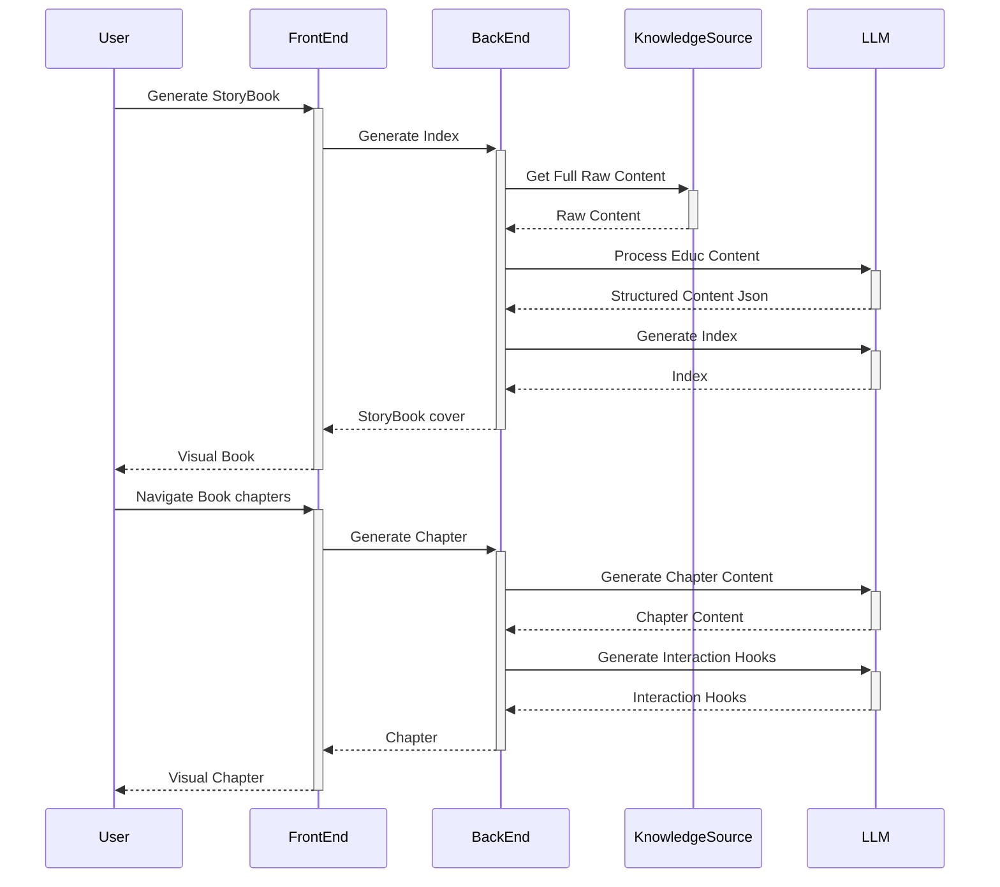

# the learning games
<a href="https://idx.google.com/import?url=https://github.com/zojeda/the-learning-games.git">
  <picture>
    <source media="(prefers-color-scheme: dark)" srcset="https://cdn.idx.dev/btn/open_dark_32.svg">
    <source media="(prefers-color-scheme: light)" srcset="https://cdn.idx.dev/btn/open_light_32.svg">
    
  </picture>
</a>

## Getting started


### start backend

```bash
$ cd backend
$ npm install # first time
$ export GOOGLE_API_KEY=<your_api_key>
$ npm run start:dev


```


